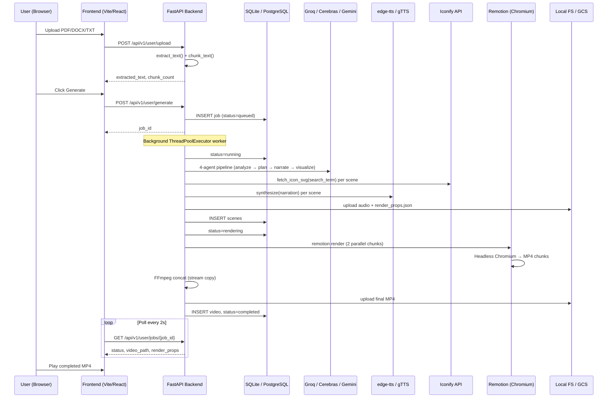
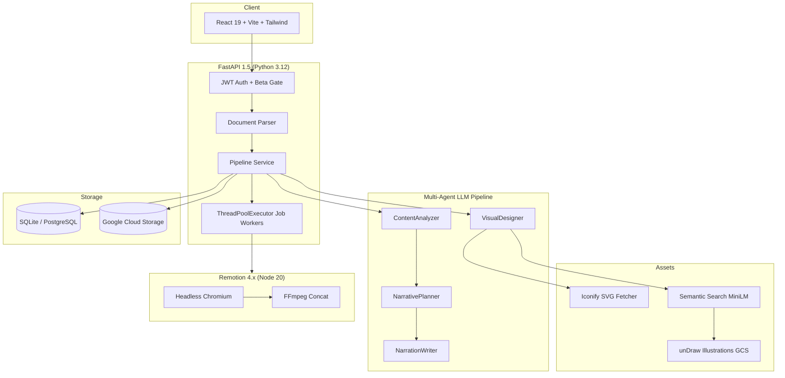
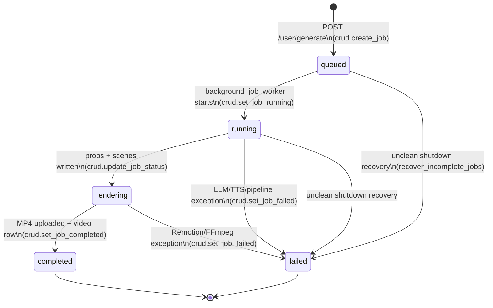
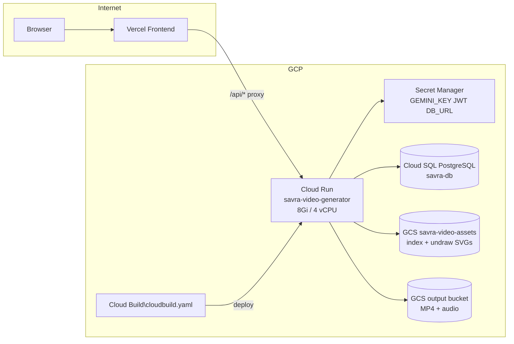

# Savra Video Generator

**Author:** Anant Vardhan Pandey · **Email:** dkpandeycan1@gmail.com  
**Repository:** [github.com/AVPthegreat/savra-video-generator](https://github.com/AVPthegreat/savra-video-generator)

## Table of Contents

1. [Overview](#overview)
2. [End-to-End Sequence](#what-it-does-end-to-end)
3. [System Architecture](#system-architecture)
4. [Pipeline Stages](#pipeline-stages-technical-detail)
5. [Job State Machine](#job-state-machine)
6. [Concurrency & Resource Model](#concurrency--resource-model)
7. [LLM Prompt Registry](#llm-prompt-registry)
8. [LLM Provider & Token Budgets](#llm-provider--token-budgets)
9. [Asset Resolution Algorithms](#asset-resolution-algorithms)
10. [Frame Timeline Mathematics](#frame-timeline-mathematics)
11. [RenderProps JSON Contract](#renderprops-json-contract)
12. [REST API — Full Payload Reference](#rest-api--full-payload-reference)
13. [HTTP Error Catalog](#http-error-catalog)
14. [Database Schema & Migrations](#database-schema--migrations)
15. [Storage Layout & Artifact Paths](#storage-layout--artifact-paths)
16. [Remotion Subprocess Invocation](#remotion-subprocess-invocation)
17. [GCP Production Topology](#gcp-production-topology)
18. [Failure Modes & Recovery Matrix](#failure-modes--recovery-matrix)
19. [Frontend Architecture](#frontend-architecture)
20. [Configuration Reference](#configuration-reference)
21. [Local Development](#local-development)
22. [Docker & Cloud Deployment](#docker--cloud-deployment)
23. [Security Model](#security-model)
24. [Project Structure](#project-structure)

---

## Overview

Savra Video Generator is an **end-to-end, asynchronous document-to-video pipeline** that ingests static educational content (PDF, DOCX, TXT) and produces **AI-narrated, whiteboard-style MP4 videos** with synchronized on-screen text, vector illustrations, and TTS voiceover.

The system is designed as three decoupled tiers:

| Tier | Directory | Role |
|------|-----------|------|
| **Dashboard** | `frontend/` | React SPA — upload, auth, job polling, video playback |
| **Orchestration API** | `backend/` | FastAPI — parsing, LLM storyboarding, TTS, job queue, render dispatch |
| **Video Engine** | `renderer/` | Remotion + Headless Chromium — frame-accurate MP4 encoding |

Production deployments target **Google Cloud Run** (monolithic container: API + Remotion + FFmpeg + Chromium) with **PostgreSQL** (Cloud SQL) and **Google Cloud Storage** for artifacts. Local development uses SQLite and filesystem-backed artifacts.

---

## What It Does (End-to-End)



---

## System Architecture



---

## Pipeline Stages (Technical Detail)

### Stage 0 — Document Ingestion

**Module:** `backend/services/parser.py`

| Input | Processing | Output |
|-------|------------|--------|
| `.pdf` | `pdfplumber` page text extraction | Normalized UTF-8 string |
| `.docx` | `python-docx` paragraph extraction | Normalized UTF-8 string |
| `.txt` | UTF-8 read with fallback | Normalized UTF-8 string |

Constraints enforced at upload (`user_router.py`):

- **Max file size:** 20 MB (HTTP 413 if exceeded)
- **Allowed extensions:** `.pdf`, `.docx`, `.txt`
- Empty files rejected with HTTP 400

Large documents are **smart-sampled** before LLM processing (`smart_sample_text`):

- If `len(text) > MAX_INPUT_CHARS` (default 15,000), the sampler takes **40% from start**, **30% from middle**, **30% from end**, snapping to paragraph boundaries and joining with `[...]` omission markers.

Scene count is derived heuristically (`calculate_scene_count`):

```python
words = len(text.split())
duration_s = (words / 130) * 60   # ~130 WPM speaking rate
count = int(duration_s / 12)
return max(4, min(count, 6))       # 4–6 scenes, ~60–90s target video
```

---

### Stage 1 — Multi-Agent LLM Storyboarding

**Module:** `backend/agents/orchestrator.py` (entry: `backend/services/multi_model_director.py`)

Four specialized agents run in a **two-phase pipeline**:

#### Phase A — Sequential Analysis (Agents 1–2)

| Agent | File | LLM Output Schema | Purpose |
|-------|------|-------------------|---------|
| **ContentAnalyzer** | `content_analyzer.py` | `{domain, concepts[], audience_level, prerequisites[], core_insight}` | Semantic understanding of source material |
| **NarrativePlanner** | `narrative_planner.py` | `{hook, conclusion, scenes[{teaching_goal, metaphor, visual_hint}]}` | Pedagogical arc with per-scene teaching goals |

Both agents call `llm_call()` with structured JSON mode. On failure, deterministic **fallback heuristics** (`fallback_analysis`, `fallback_plan`) prevent pipeline abort.

#### Phase B — Parallel Per-Scene Generation (Agents 3–4)

For each scene (up to 8 concurrent threads via `ThreadPoolExecutor`):

| Agent | File | Output | Purpose |
|-------|------|--------|---------|
| **NarrationWriter** | `narration_writer.py` | `{heading, body}` | Conversational spoken script (~15–37 words/scene) |
| **VisualDesigner** | `visual_designer.py` | `{style, description, search_term}` | Visual style decision + icon search keyword |

`VisualDesigner` style enum: `icon | diagram | abstract | code | none`

If style ≠ `none`, `fetch_svg()` resolves a real SVG via the asset pipeline (below).

#### LLM Provider Fallback Chain

**Module:** `backend/agents/base.py`

```
Groq (llama-4-scout-17b) → Cerebras (llama3.1-8b) → Gemini (gemini-2.5-flash)
```

- OpenAI-compatible API clients with 15s timeout per provider
- Automatic failover on 429 / rate-limit / quota errors
- JSON response format enforced (`response_format: json_object`)
- Requires at least one configured API key (`GROQ_API_KEY`, `CEREBRAS_API_KEY`, or `GEMINI_API_KEY`)

---

### Stage 2 — Asset Resolution

Two complementary systems resolve on-screen visuals:

#### A. Iconify SVG Fetcher

**Module:** `backend/services/icon_fetcher.py`

```
metaphor_hint / search_term
  → keyword_from_hint()        # stop-word removal, abstract→concrete mapping
  → Iconify Search API         # https://api.iconify.design
  → prefix preference: tabler > lucide > carbon > material-symbols > ph > mdi
  → normalize_svg()            # strip dimensions, enforce viewBox, remove fills
  → disk cache (/tmp/iconify_cache)
```

Brand/logo icon sets (`simple-icons`, `logos`, emoji sets) are explicitly excluded.

#### B. Semantic Asset Search (unDraw)

**Module:** `backend/services/semantic_search.py`

- **Embedding model:** `sentence-transformers/all-MiniLM-L6-v2` (pre-downloaded at Docker build time)
- **Index:** `assets/index.json` — precomputed embeddings for unDraw illustration catalog
- **Query:** Cosine similarity against scene narration/visual hints
- **Thresholds:** HIGH=0.55, MID=0.45, MIN=0.35 (tiered slot filling)
- **Production bootstrap:** `scripts/fetch_assets.py` syncs index + SVGs from `GCS_ASSETS_BUCKET` at container startup

---

### Stage 3 — Text-to-Speech Synthesis

**Module:** `backend/services/audio_gen.py`

| Provider | Library | Voice | Fallback |
|----------|---------|-------|----------|
| Primary | `edge-tts` | `en-US-GuyNeural` | — |
| Fallback | `gTTS` | English | Used if edge-tts fails |

- Async synthesis via `asyncio.new_event_loop()` (safe inside worker threads)
- **120s timeout** per scene to prevent hung workers
- Duration measured with `mutagen` → `audio_duration_ms` drives Remotion timeline

Each scene produces: `runs/{job_id}/audio/scene_{N}.mp3`

---

### Stage 4 — Choreography Assembly

**Schema:** `backend/core/schemas.py`

The pipeline assembles `SceneChoreography` objects — the contract between backend and Remotion:

```python
class SceneChoreography:
    scene_id: int
    scene_title: str
    narration: str
    on_screen_text: str
    svg_content: str              # inline SVG markup
    svg_path: str                 # iconify://keyword or none://
    audio_path: str               # relative artifact URL
    audio_duration_ms: int        # TTS-measured
    draw_start_ms: int
    draw_duration_ms: int
    hold_ms: int
    canvas_x/y/width/height: int  # infinite-canvas spatial metadata
    layout_direction: str         # "right" | "down" | ...
    kinetic_words: list[str]
```

All scenes are serialized into `RenderProps`:

```python
class RenderProps:
    fps: int = 30
    width: int = 1920
    height: int = 1080
    scenes: list[SceneChoreography]
```

Written to `runs/{job_id}/render_props.json` and persisted to DB (`scenes` table).

---

### Stage 5 — Remotion Video Rendering

**Module:** `backend/services/pipeline_service.py` → `renderer/`

#### Parallel Chunk Strategy

Scenes are split into **2 groups** and rendered concurrently:

```
Group 0: scenes[0..N/2]  →  chunk_0.mp4  (concurrency=6 Chromium tabs)
Group 1: scenes[N/2..N]  →  chunk_1.mp4  (concurrency=6)
```

- Global `_LAUNCH_LOCK` prevents `ETXTBSY` binary contention on simultaneous Remotion CLI launches
- 0.5s stagger between chunk launches
- `_RENDER_LIMITER` semaphore caps concurrent full render jobs (`MAX_CONCURRENT_RENDERS`, default 1)

#### Remotion Composition

**Entry:** `renderer/src/Root.tsx` → `Whiteboard` composition

| Property | Value |
|----------|-------|
| Resolution | 1920×1080 |
| FPS | 30 |
| Duration | `Σ(audio_duration_ms)` per scene, converted to frames |

**Visual layers per scene** (`renderer/src/Whiteboard.tsx`):

1. `MeshGradientBg` — animated gradient background (palette rotates per scene)
2. `AnimatedText` (remotion-bits) — kinetic word-stagger title + body text
3. Inline SVG panel — glassmorphic card with fetched icon/illustration
4. `Audio` sequence — TTS MP3 synced to scene frame range

#### FFmpeg Stitching

```bash
ffmpeg -y -f concat -safe 0 -i concat_list.txt -c copy output.mp4
```

Stream copy (no re-encode) for lossless, fast concatenation of chunk MP4s.

Final artifact: `runs/{job_id}.mp4` → uploaded via storage provider.

---

## Database Schema

**ORM:** SQLAlchemy 2.x · **Migrations:** Alembic

```
users
├── id, username, email, hashed_password
├── is_admin, is_beta_authorized, has_seen_onboarding
└── created_at

jobs
├── id (UUID hex), user_id (FK), status
├── status: queued | running | rendering | completed | failed
├── error (TEXT), input_filename
└── created_at, updated_at

scenes (1:N per job)
├── scene_index, narration, on_screen_text
├── svg_markup, svg_path, metaphor_hint
├── audio_path, audio_duration_ms
├── draw_start_ms, draw_duration_ms, hold_ms
├── canvas_x/y/width/height, layout_direction
└── kinetic_words_json

videos (1:1 per job)
├── file_path, file_size_bytes, duration_ms
└── created_at
```

**Local dev:** `sqlite:///./savra.db` (auto-created)  
**Production:** PostgreSQL via `DATABASE_URL` (Cloud SQL socket)

On startup, stale jobs from crashes are recovered (`crud.recover_incomplete_jobs`) if `RECOVER_STALE_JOBS_ON_STARTUP=true`.

---

## REST API Reference

Base URL: `http://localhost:8000` (local) · OpenAPI docs at `/api/docs`

All authenticated routes require a JWT in the `access_token` HttpOnly cookie (set by `/auth/login`).

### Authentication (`/api/v1/auth`)

| Method | Path | Auth | Description |
|--------|------|------|-------------|
| `POST` | `/signup` | Public | Register (beta access pending admin approval) |
| `POST` | `/login` | Public | Set HttpOnly JWT cookie |
| `POST` | `/logout` | Public | Clear cookie |
| `GET` | `/me` | JWT | Current user profile |

### User Pipeline (`/api/v1/user`)

Requires `is_beta_authorized=true` or `is_admin=true`.

| Method | Path | Description |
|--------|------|-------------|
| `POST` | `/upload` | Multipart file upload → `{extracted_text, chunk_count}` |
| `POST` | `/generate` | Queue render job → `{job_id, status: "queued"}` |
| `GET` | `/jobs/{job_id}` | Poll status → `{status, render_props, video_path, error}` |
| `POST` | `/mark-onboarded` | Dismiss beta onboarding modal |

**Rate limit:** Non-admin users — **1 successful video per 24 hours** (HTTP 429). Admins bypass quota.

### Admin (`/api/v1/admin`)

Requires `is_admin=true`.

| Method | Path | Description |
|--------|------|-------------|
| `GET` | `/users` | List all registered users |
| `PUT` | `/users/{id}/approve` | Grant/revoke beta access |
| `DELETE` | `/users/{id}` | Delete user (cannot delete admins) |
| `POST` | `/users` | Create user manually |
| `GET` | `/stats` | Dashboard metrics (job counts, beta users) |

### System

| Method | Path | Description |
|--------|------|-------------|
| `GET` | `/healthz` | Liveness probe → `{status: "ok", version: "1.5.0"}` |
| `GET` | `/api/artifacts/{path}` | Serve local artifacts (dev) or redirect to GCS (prod) |

---

## Frontend Architecture

**Stack:** React 19 · Vite 8 · TypeScript · Tailwind CSS 4 · Framer Motion · Axios

| Component | File | Responsibility |
|-----------|------|----------------|
| Landing Page | `LandingPage.tsx` | Marketing hero, feature cards, GitHub link |
| Admin Login | `AdminLogin.tsx` | JWT authentication gate |
| Dashboard | `Dashboard.tsx` | Drag-and-drop upload, text preview, generate button, job polling, video player |
| Admin Panel | `AdminPanel.tsx` | User moderation, beta approval, system stats |
| Auth Context | `AuthContext.tsx` | Global JWT session state via `/auth/me` |

**Job polling:** Dashboard polls `GET /jobs/{job_id}` every ~2s until `status ∈ {completed, failed}`.

**Proxy:** Vite dev server proxies `/api/*` to `localhost:8000` (configured in `vite.config.ts`).

---

## Configuration Reference

Copy `.env.example` → `.env` for local development.

### Core

| Variable | Default | Description |
|----------|---------|-------------|
| `APP_ENV` | `development` | `development` or `production` |
| `GEMINI_API_KEY` | — | Google Gemini API key |
| `GEMINI_MODEL` | `gemini-2.5-flash` | Gemini model identifier |
| `DATABASE_URL` | `sqlite:///./savra.db` | SQLAlchemy connection string |
| `MAX_INPUT_CHARS` | `15000` | Max characters sent to LLM after sampling |
| `MAX_UPLOAD_MB` | `20` | Upload size limit |
| `OUTPUT_DIR` | `../renderer/public` | Local artifact output directory |

### LLM Providers

| Variable | Description |
|----------|-------------|
| `USE_MULTI_MODEL_DIRECTOR` | Enable 4-agent pipeline (always on in current code path) |
| `GROQ_API_KEY` | Groq API key (primary LLM provider) |
| `CEREBRAS_API_KEY` | Cerebras API key (secondary fallback) |

### Authentication

| Variable | Default | Description |
|----------|---------|-------------|
| `ENABLE_AUTH` | `true` | Set `false` to bypass JWT in local dev |
| `AUTH_USERNAME` | `admin` | Seed admin username |
| `AUTH_PASSWORD` | `change_me` | Seed admin password |
| `JWT_SECRET` | `change_me` | HS256 signing secret |
| `ACCESS_TOKEN_EXPIRE_MINUTES` | `1440` | Token TTL (24h) |

### Job Queue & Rendering

| Variable | Default | Description |
|----------|---------|-------------|
| `JOB_WORKER_COUNT` | `2` | Background pipeline thread pool size |
| `JOB_QUEUE_CAPACITY` | `6` | Max queued jobs |
| `MAX_CONCURRENT_RENDERS` | `1` | Semaphore limit for simultaneous Remotion renders |
| `RECOVER_STALE_JOBS_ON_STARTUP` | `true` | Mark crashed jobs as failed on boot |

### Asset Pipeline

| Variable | Default | Description |
|----------|---------|-------------|
| `ASSET_INDEX_PATH` | `assets/index.json` | Semantic search embedding index |
| `ASSET_UNDRAW_DIR` | `assets/undraw` | Local unDraw SVG cache |
| `ASSET_CACHE_DIR` | `/tmp/iconify_cache` | Iconify disk cache |
| `SEMANTIC_THRESHOLD` | `0.30` | Cosine similarity cutoff |
| `GCS_ASSETS_BUCKET` | `gs://savra-video-assets` | Source bucket for asset bootstrap |
| `GCS_BUCKET_NAME` | — | Production artifact output bucket |

### Production Safety

When `APP_ENV=production`:

- Refuses boot if `AUTH_PASSWORD`, `JWT_SECRET`, or `GEMINI_API_KEY` are insecure defaults
- Loads secrets from **GCP Secret Manager** if `GOOGLE_CLOUD_PROJECT` is set
- Redirects SQLite paths to `/tmp/savra.db` (Cloud Run ephemeral FS)
- Uses `GcsStorageProvider` when `GCS_BUCKET_NAME` is configured

---

## Local Development

### Prerequisites

- Python 3.12+
- Node.js 20+
- FFmpeg (system PATH)
- At least one LLM API key (Groq recommended for speed)

### Setup

```bash
cp .env.example .env
# Edit .env — set GEMINI_API_KEY, optionally GROQ_API_KEY
# Set ENABLE_AUTH=false for passwordless local dev
```

### Run Backend

```bash
cd backend
python -m venv .venv && source .venv/bin/activate
pip install -r requirements.txt
alembic upgrade head          # from project root: alembic -c backend/alembic.ini upgrade head
uvicorn backend.main:app --reload --app-dir ..
```

Backend listens on `http://localhost:8000`.

### Run Frontend

```bash
cd frontend
npm install
npm run dev
```

Frontend listens on `http://localhost:5173`.

### Run Renderer (standalone test)

```bash
cd renderer
npm install
npm run preview    # Remotion Studio
# Or render directly:
npx remotion render src/Root.tsx Whiteboard --props=./render_props.json out.mp4
```

---

## Docker & Cloud Deployment

### Docker Compose (local full stack)

```bash
docker compose up --build
```

Services: `backend` (port 8000) + `db` (PostgreSQL 16).

### Production Container

The `Dockerfile` builds a single image containing:

- Python 3.12 + all pip dependencies
- Node.js 20 + Remotion CLI (`npm ci` in `/app/renderer`)
- System Chromium + FFmpeg
- Pre-cached MiniLM sentence-transformer model

**Startup sequence** (CMD):

```bash
python scripts/migrate_db.py      # Alembic migrations
python scripts/fetch_assets.py    # GCS → local asset sync
uvicorn backend.main:app --host 0.0.0.0 --port ${PORT:-8080}
```

### Google Cloud Build

```bash
gcloud builds submit --config cloudbuild.yaml
```

Cloud Run service spec (from `cloudbuild.yaml`):

| Resource | Value |
|----------|-------|
| Memory | 8 GiB |
| CPU | 4 vCPU |
| Timeout | 3600s (1 hour) |
| Max instances | 1 |
| Cloud SQL | `$PROJECT_ID:europe-west1:savra-db` |

Required GCP Secret Manager secrets:

- `GEMINI_API_KEY`
- `DATABASE_URL`
- `JWT_SECRET`
- `ADMIN_PASSWORD`

---

## Security Model

| Control | Implementation |
|---------|----------------|
| Authentication | JWT (HS256) in HttpOnly + Secure + SameSite=Lax cookie |
| Authorization | Role-based: `is_admin`, `is_beta_authorized` |
| Upload validation | Extension whitelist + 20 MB cap + empty file rejection |
| Path traversal | `LocalStorageProvider` resolves paths with `is_relative_to()` guard |
| Production boot guard | Pydantic validator rejects insecure default credentials |
| Request tracing | `X-Request-ID` middleware on every response |
| CORS | Explicit origin allowlist (localhost dev ports) |
| Rate limiting | 1 video/day per non-admin user |

---

## Project Structure

```
savra-video-generator/
├── backend/
│   ├── agents/              # 4-agent LLM pipeline
│   │   ├── base.py          # LLM fallback chain + JSON parser
│   │   ├── content_analyzer.py
│   │   ├── narrative_planner.py
│   │   ├── narration_writer.py
│   │   ├── visual_designer.py
│   │   └── orchestrator.py  # Parallel scene assembly
│   ├── api/v1/              # REST route handlers
│   ├── auth/                # JWT + bcrypt security
│   ├── core/                # Config, Pydantic schemas, GCP secrets
│   ├── db/                  # SQLAlchemy models, CRUD, Alembic migrations
│   ├── services/
│   │   ├── pipeline_service.py    # Main async job orchestrator
│   │   ├── multi_model_director.py
│   │   ├── parser.py              # PDF/DOCX/TXT extraction
│   │   ├── audio_gen.py           # edge-tts + gTTS
│   │   ├── icon_fetcher.py        # Iconify SVG resolver
│   │   ├── semantic_search.py     # MiniLM embedding search
│   │   └── storage_service.py     # Local / GCS abstraction
│   └── main.py              # FastAPI app entrypoint
├── frontend/                # React dashboard SPA
├── renderer/                # Remotion video composition
│   └── src/
│       ├── Root.tsx         # Composition registration
│       ├── Whiteboard.tsx   # Main scene renderer
│       └── components/remocn/  # Mesh gradient, blur reveal, highlights
├── scripts/
│   ├── migrate_db.py        # Alembic runner
│   ├── fetch_assets.py      # GCS asset bootstrap
│   ├── seed_admin.py        # Idempotent admin user creation
│   └── build_asset_index.py # unDraw embedding index builder
├── docs/                    # Architecture & API planning docs
├── infra/nginx/             # Reverse proxy config (production)
├── Dockerfile
├── docker-compose.yml
├── cloudbuild.yaml
└── pipeline.py              # CLI client for headless API testing
```

---

## CLI Testing Tool

`pipeline.py` provides a headless client for testing the API without the frontend:

```bash
python pipeline.py --file document.pdf --token <jwt>
```

Uploads the file, queues generation, polls until completion, and prints the video URL.

---

## Job State Machine

Every video generation job transitions through a strict finite state machine persisted in `jobs.status`:



| State | DB value | Worker phase | User-visible behavior |
|-------|----------|--------------|----------------------|
| `queued` | `queued` | Job submitted to `ThreadPoolExecutor` | Spinner: "Queued" |
| `running` | `running` | LLM agents + TTS + props assembly | Spinner: "Generating scenes" |
| `rendering` | `rendering` | Remotion CLI + FFmpeg stitch | Spinner: "Rendering video" |
| `completed` | `completed` | Artifacts in storage | Video player loads `video_path` |
| `failed` | `failed` | Worker exited with exception | Error banner with `error` string |

**Stale job recovery:** On application boot (`lifespan` in `main.py`), if `RECOVER_STALE_JOBS_ON_STARTUP=true`, all jobs in `queued` or `running` are bulk-updated to `failed` with reason `"Job lost due to service restart/crash"`. This prevents phantom in-progress jobs after Cloud Run container recycle.

---

## Concurrency & Resource Model

The pipeline uses **three independent concurrency primitives** that must not be confused:

### 1. Job Worker Pool

```python
_JOB_EXECUTOR = ThreadPoolExecutor(max_workers=JOB_WORKER_COUNT)  # default: 2
```

- Each `/user/generate` call submits `_background_job_worker` as a fire-and-forget future
- Workers are **daemon threads** — they run the full pipeline synchronously inside the thread
- No explicit queue capacity enforcement at submit time (jobs always accepted; backpressure is operational, not API-level)

### 2. Render Semaphore

```python
_RENDER_LIMITER = BoundedSemaphore(value=MAX_CONCURRENT_RENDERS)  # default: 1
```

- Acquired only during `_run_remotion_render()` — the Chromium-heavy phase
- Prevents OOM on Cloud Run when multiple jobs complete LLM/TTS simultaneously
- Released automatically on context exit even if render throws

### 3. Remotion Launch Lock

```python
_LAUNCH_LOCK = Lock()  # threading.Lock, global singleton
```

- Serializes `subprocess.run(remotion render ...)` invocations
- Prevents Linux `ETXTBSY` (text file busy) when two Remotion CLI processes race to exec the same Node binary
- Includes **500ms sleep** inside the lock before each launch

### 4. Intra-Pipeline Parallelism

| Stage | Parallelism | Max workers |
|-------|-------------|-------------|
| Per-scene narration + visual design | `ThreadPoolExecutor` | `min(scene_count, 8)` |
| Remotion chunk render | `ThreadPoolExecutor` | `n_groups = 2` |
| Remotion internal tabs | `--concurrency=6` per chunk | 6 Chromium tabs |

### 5. Chunk Render Stagger

```python
n_groups = 2
chunk_size = ceil(len(scenes) / n_groups)
# Group 0 launches immediately
# Group 1 launches after sleep(1.0)
```

Each chunk validates output: `file.size >= 1000 bytes` or raises `RuntimeError`.

Final stitch validates: `stitched.mp4.size >= 5000 bytes`.

---

## LLM Prompt Registry

All agents use `llm_call()` from `backend/agents/base.py`. Prompts below are **verbatim** from source.

### Agent 1 — ContentAnalyzer (`content_analyzer.py`)

**System prompt:**
```
You are analyzing educational content for a teaching video.
Identify the following from the text:

- domain: The subject area (e.g. "Docker containers", "Kubernetes", "Python")
- concepts: 3-6 key concepts that need explaining (as short phrases)
- audience_level: "beginner", "intermediate", or "advanced"
- prerequisites: What the learner should already know (list, can be empty)
- core_insight: The single most important "aha" takeaway (one sentence)

Be concise. Just extract what's actually in the text.

Respond with JSON: {"domain": "...", "concepts": [...], "audience_level": "...", "prerequisites": [...], "core_insight": "..."}
```

**Output schema:**
```json
{
  "domain": "string",
  "concepts": ["string", "..."],
  "audience_level": "beginner|intermediate|advanced",
  "prerequisites": ["string"],
  "core_insight": "string"
}
```

**Limits:** `max_tokens=400`

### Agent 2 — NarrativePlanner (`narrative_planner.py`)

**System prompt (templated):**
```
You are designing a teaching arc for an educational video.

Domain: {domain}
Key concepts: {concepts}
Audience: {audience_level}
Core insight: {core_insight}

You have {scene_count} scenes. Each scene covers ONE idea.

Design a conversational teaching arc:

1. HOOK (1 sentence): A relatable problem or question that grabs attention
2. Scenes: For each scene, provide:
   - teaching_goal: What the learner will understand (1 sentence)
   - metaphor: An everyday analogy that makes the concept click
   - visual_hint: What could appear on screen — can be abstract or concrete
3. CONCLUSION (1 sentence): The final takeaway

Rules:
- Teach like a friend explaining over coffee, not a textbook
- Use relatable analogies the audience already understands
- Each scene builds on the previous one
- Avoid jargon unless you plan to explain it
- visual_hint can be abstract (e.g. "glowing network lines", "stacking blocks") — no asset fetching

Respond with JSON:
{"hook": "...", "scenes": [{"teaching_goal": "...", "metaphor": "...", "visual_hint": "..."}], "conclusion": "..."}
```

**Output schema:**
```json
{
  "hook": "string",
  "scenes": [
    {"teaching_goal": "string", "metaphor": "string", "visual_hint": "string"}
  ],
  "conclusion": "string"
}
```

**Limits:** `max_tokens=1200`. Pads with empty `ScenePlan` objects if LLM returns fewer than `scene_count` scenes.

### Agent 3 — NarrationWriter (`narration_writer.py`)

**System prompt (templated):**
```
Write narration for ONE scene of an educational video.

Context:
- Video domain: {domain}
- Teaching goal for this scene: {teaching_goal}
- Metaphor to use: {metaphor}

Rules:
- Explain like talking to a curious 12 year old who knows nothing
- Start with a relatable everyday example or story, THEN explain
- Use simple words. No jargon. If you must use a technical term, explain it right after.
- Short sentences. One idea per sentence. Like telling a friend at a coffee shop.
- NEVER start with "Imagine", "In this section", "This refers to", or "It is important to note"
- Vary sentence starters: "Here is the cool part...", "So basically...", "Think about...", "Here is how...", "This happens because..."
- STRICT LIMIT: body must be exactly {word_guidance} words. Count carefully.
- End naturally — the video flows to the next scene

Return JSON:
{"heading": "A short 3-5 word title for this scene", "body": "The narration text..."}
```

**Token budget:** `max_tokens = int(max_words * 1.8) + 5`  
**Post-processing:** `truncate_narration()` snaps to last sentence boundary if word count exceeded.

**Default word cap per scene:**
```python
max_words_per_narration = max(10, 195 // scene_count)
words_per_scene = max(15, max_words_per_narration)
```

For 5 scenes: `195 // 5 = 39` words max per narration body.

### Agent 4 — VisualDesigner (`visual_designer.py`)

**System prompt (templated):**
```
For an educational video scene, suggest if a visual would help.

Scene context:
- Narration: {narration}
- Visual hint from planning: {visual_hint}
- Teaching goal: {teaching_goal}

Decide:
- style: "icon" (simple symbol matching the concept), "diagram" (relationship/flow), "abstract" (decorative shapes), "code" (code block), "none" (text-only)
- description: Describe briefly what appears on screen. (max 8 words)
- search_term: A keyword to search for an icon/image (e.g. "brain", "server", "network"). Empty string if style is "none" or "abstract".

Prefer adding visuals over text-only. A simple icon makes the scene more engaging.
When in doubt, choose "icon" with a relevant search_term.

Respond with JSON: {"style": "...", "description": "...", "search_term": "..."}
```

**Limits:** `max_tokens=100`. Invalid `style` values coerced to `"icon"`.

---

## LLM Provider & Token Budgets

### Fallback Chain (`backend/agents/base.py`)

| Priority | Provider | Model | Base URL | Timeout |
|----------|----------|-------|----------|---------|
| 1 | Groq | `meta-llama/llama-4-scout-17b-16e-instruct` | `https://api.groq.com/openai/v1` | 15s |
| 2 | Cerebras | `llama3.1-8b` | `https://api.cerebras.ai/v1` | 15s |
| 3 | Gemini | `gemini-2.5-flash` | `https://generativelanguage.googleapis.com/v1beta/openai/` | 15s |

**Failover triggers:** HTTP 429, `"rate limit"`, `"quota"`, `"resource_exhausted"`, `"too many"` in exception string.

**JSON mode:** Enabled for Agents 1, 2, 4. Disabled for Agent 3 (NarrationWriter) — relies on `parse_json()` regex strip of markdown fences.

**Aggregate token budget per 5-scene job (approximate):**

| Agent | Calls | Tokens/call | Total |
|-------|-------|-------------|-------|
| ContentAnalyzer | 1 | 400 | 400 |
| NarrativePlanner | 1 | 1200 | 1200 |
| NarrationWriter | 5 | ~75 each | ~375 |
| VisualDesigner | 5 | 100 each | 500 |
| **Total** | 12 | — | **~2,475 output tokens** |

Input tokens scale with `min(len(text), MAX_INPUT_CHARS)`.

---

## Asset Resolution Algorithms

### A. Iconify SVG Fetcher (`icon_fetcher.py`)

**Resolution pipeline:**

```
search_term (from VisualDesigner)
  │
  ├─► keyword_from_hint() if metaphor-based
  │     1. Lowercase + strip punctuation
  │     2. Remove _FILLER_WORDS (60+ stop/meta terms)
  │     3. Map via _ABSTRACT_MAP (80+ abstract→concrete pairs)
  │     4. Return first 1–2 remaining words, else "document"
  │
  ├─► GET https://api.iconify.design/search?query={keyword}&limit=32
  │
  ├─► Filter results:
  │     SKIP prefixes in _EXCLUDED_PREFIXES (simple-icons, logos, twemoji, …)
  │     PREFER prefixes in _PREFERRED_PREFIXES (tabler > lucide > carbon > …)
  │
  ├─► GET https://api.iconify.design/{prefix}/{icon}.svg
  │
  ├─► normalize_svg():
  │     - Strip width/height attributes
  │     - Inject viewBox if missing
  │     - Convert fills to stroke-based paths for whiteboard draw aesthetic
  │     - Scale transform wrapper for 400×300 viewport
  │
  └─► Cache to $ASSET_CACHE_DIR/{hash}.svg
```

**Excluded icon sets:** `simple-icons`, `logos`, `game-icons`, `circle-flags`, `flag`, `twemoji`, `noto`, `openmoji`, `emojione`, `fxemoji`, `fa-brands`

### B. Semantic Search (`semantic_search.py`)

**Model:** `sentence-transformers/all-MiniLM-L6-v2` (384-dim embeddings, L2-normalized)

**Index format (`assets/index.json`):**
```json
[
  {
    "id": "undraw_123",
    "path": "assets/undraw/svg/undraw_server.svg",
    "text": "server infrastructure cloud",
    "embedding": [0.012, -0.034, "...384 floats"]
  }
]
```

**Tiered cosine similarity retrieval:**

```python
# qvec = model.encode(query, normalize_embeddings=True)
# sims = index_matrix @ qvec   # dot product == cosine (both normalized)

Pass 1: score >= 0.55 (SEMANTIC_THRESHOLD env, default overridden to 0.55 in code)
Pass 2: score >= 0.45 (fill remaining top_k slots)
Pass 3: score >= 0.35 (last-resort if results still empty)
```

Returns `[]` if index missing, model load fails, or all scores below 0.35.

**Dedup:** `exclude_ids` parameter prevents reusing assets within the same job.

---

## Frame Timeline Mathematics

Remotion timeline is derived entirely from TTS-measured durations — **no manual timing input**.

### Scene Duration

```python
# backend/services/pipeline_service.py + renderer/src/Whiteboard.tsx

audio_duration_ms = mutagen.info.length * 1000   # from TTS output MP3

frame_count = max(1, round((audio_duration_ms / 1000) * fps))
# fps = 30 (default)
```

### Composition Total Duration

```typescript
// renderer/src/Root.tsx
totalMs = scenes.reduce((sum, s) => sum + s.audio_duration_ms, 0)
durationInFrames = max(90, ceil((totalMs / 1000) * fps))
// Minimum 90 frames = 3 seconds (empty/single-scene guard)
```

### Scene Start Frames (Sequential Layout)

```typescript
cumulative = 0
for each scene i:
  startFrames[i] = cumulative
  cumulative += msToFrames(scenes[i].audio_duration_ms, fps)
```

Scenes are **hard-cut** (no crossfade) — each `Sequence` component occupies `[startFrames[i], startFrames[i] + sceneFrames[i])`.

### Example Calculation

| Scene | narration words | TTS duration | Frames @ 30fps |
|-------|-----------------|--------------|----------------|
| 1 | 35 | 12,400 ms | 372 |
| 2 | 38 | 14,100 ms | 423 |
| 3 | 32 | 11,800 ms | 354 |
| 4 | 40 | 15,200 ms | 456 |
| **Total** | — | **53,500 ms** | **1,605 frames (53.5s)** |

---

## RenderProps JSON Contract

The backend→Remotion IPC contract. Written to `runs/{job_id}/render_props.json` and passed via `--props=` CLI flag.

### Full Schema (Pydantic `RenderProps` + `SceneChoreography`)

```typescript
interface RenderProps {
  fps: number;          // default 30
  width: number;        // default 1920
  height: number;       // default 1080
  scenes: SceneChoreography[];
}

interface SceneChoreography {
  scene_id: number;               // 1-based
  scene_title: string;            // from NarrationWriter heading
  narration: string;              // TTS input text
  on_screen_text: string;         // displayed kinetic text (usually == narration)
  svg_markup: string;             // legacy field, often empty
  metaphor_hint: string;
  audio_path: string;             // "runs/{job_id}/audio/scene_N.mp3" or GCS URL
  svg_path: string;               // "iconify://keyword" | "none://"
  svg_content: string;            // inline SVG XML for Remotion dangerouslySetInnerHTML
  audio_duration_ms: number;      // mutagen-measured, drives timeline
  draw_start_ms: number;          // reserved for stroke animation (currently 0)
  draw_duration_ms: number;       // reserved (currently == audio_duration_ms)
  hold_ms: number;                // reserved post-draw hold
  canvas_x: number;               // infinite-canvas world coords
  canvas_y: number;
  canvas_width: number;           // default 1920
  canvas_height: number;          // default 1080
  layout_direction: string;       // "right" | "down"
  kinetic_words: string[];        // remotion-bits word highlight targets
  svg_content_secondary?: string; // dual-illustration layout (optional)
  svg_path_secondary?: string;
}
```

### Example Payload (abbreviated)

```json
{
  "fps": 30,
  "width": 1920,
  "height": 1080,
  "scenes": [
    {
      "scene_id": 1,
      "scene_title": "What Are Containers",
      "narration": "Think about shipping boxes. Docker works the same way for software.",
      "on_screen_text": "Think about shipping boxes. Docker works the same way for software.",
      "svg_markup": "",
      "metaphor_hint": "shipping containers",
      "audio_path": "runs/a1b2c3d4/audio/scene_1.mp3",
      "svg_path": "iconify://package",
      "svg_content": "<svg viewBox=\"0 0 400 300\" xmlns=\"http://www.w3.org/2000/svg\">...</svg>",
      "audio_duration_ms": 4200,
      "draw_start_ms": 0,
      "draw_duration_ms": 4200,
      "hold_ms": 0,
      "canvas_x": 0,
      "canvas_y": 0,
      "canvas_width": 1920,
      "canvas_height": 1080,
      "layout_direction": "right",
      "kinetic_words": []
    }
  ]
}
```

---

## REST API — Full Payload Reference

**Base URL:** `http://localhost:8000`  
**Auth mechanism:** JWT in `access_token` HttpOnly cookie (set by `POST /api/v1/auth/login`)  
**OpenAPI:** `/api/docs` · **ReDoc:** `/api/redoc`

### `POST /api/v1/auth/signup`

```json
// Request
{"username": "student1", "email": "student@example.com", "password": "securepass123"}

// Response 200
{"id": 2, "username": "student1", "email": "student@example.com", "is_admin": false, "is_beta_authorized": false, "has_seen_onboarding": false}
```

New users have `is_beta_authorized=false` until admin approval.

### `POST /api/v1/auth/login`

```json
// Request
{"username": "admin", "password": "your_password"}

// Response 200 + Set-Cookie: access_token=eyJ...; HttpOnly; Secure; SameSite=Lax; Max-Age=604800
{"status": "ok", "message": "Logged in successfully"}
```

JWT payload: `{"sub": "<username>", "exp": <unix_timestamp>}` signed with HS256.

### `POST /api/v1/user/upload`

```
Content-Type: multipart/form-data
Body: file=<binary>  (.pdf | .docx | .txt, max 20MB)
```

```json
// Response 200
{"extracted_text": "Full document text...", "chunk_count": 3}

// Response 400 — unsupported type / empty file / no extractable text
{"detail": "Unsupported file type"}

// Response 413
{"detail": "File too large (Max 20MB)"}
```

### `POST /api/v1/user/generate`

```json
// Request
{"extracted_text": "Document text to convert..."}

// Response 200
{"job_id": "f8cad468c89440aeb33a01c328bebbcb", "status": "queued"}

// Response 429 (non-admin, daily quota exceeded)
{"detail": "You have reached your daily limit (1 successful video per 24h). Please try again later."}
```

### `GET /api/v1/user/jobs/{job_id}`

```json
// Response 200 — in progress
{
  "job_id": "f8cad468c89440aeb33a01c328bebbcb",
  "status": "rendering",
  "created_at": "2026-06-10T12:00:00+00:00",
  "updated_at": "2026-06-10T12:01:30+00:00",
  "error": null,
  "render_props": null,
  "video_path": null
}

// Response 200 — completed
{
  "job_id": "f8cad468c89440aeb33a01c328bebbcb",
  "status": "completed",
  "created_at": "2026-06-10T12:00:00+00:00",
  "updated_at": "2026-06-10T12:03:45+00:00",
  "error": null,
  "render_props": { "fps": 30, "width": 1920, "height": 1080, "scenes": ["..."] },
  "video_path": "/artifacts/runs/f8cad468c89440aeb33a01c328bebbcb.mp4"
}

// Response 200 — failed
{
  "status": "failed",
  "error": "Video Engine Failure: Render Engine Error (Chunk 0): ..."
}

// Response 404 — wrong user or unknown job
{"detail": "Not found"}
```

### `GET /api/v1/admin/stats`

```json
// Response 200
{
  "total_users": 12,
  "beta_users": 8,
  "total_jobs": 45,
  "completed_jobs": 38,
  "failed_jobs": 4,
  "running_jobs": 1
}
```

---

## HTTP Error Catalog

| Code | Endpoint(s) | Condition | Response body |
|------|-------------|-----------|---------------|
| 400 | `/upload` | Empty file, bad extension, no text | `{"detail": "..."}` |
| 400 | `/auth/signup` | Duplicate username/email | `{"detail": "Username already registered"}` |
| 401 | All protected routes | Missing/invalid JWT cookie | `{"detail": "Could not validate credentials"}` |
| 403 | `/user/*` | User not beta-approved | `{"detail": "Your account is pending beta authorization..."}` |
| 403 | `/admin/*` | Non-admin access | `{"detail": "The user does not have enough privileges"}` |
| 404 | `/jobs/{id}` | Job not found or wrong owner | `{"detail": "Not found"}` |
| 413 | `/upload` | File > 20 MB | `{"detail": "File too large (Max 20MB)"}` |
| 429 | `/generate` | Daily quota (non-admin) | `{"detail": "You have reached your daily limit..."}` |
| 500 | Startup | Insecure prod credentials | Process exit via Pydantic `ValueError` |

**Pipeline-internal errors** (stored in `jobs.error`, not HTTP):

| Error prefix | Source | Typical cause |
|--------------|--------|---------------|
| `Video Engine Failure:` | `_run_remotion_render` | Chromium OOM, Remotion CLI crash |
| `Render Engine Error (Chunk N):` | `_render_scene_group` | Invalid props, missing audio file |
| `No text content available` | `_generate_render_props_internal` | Empty input after sampling |
| `Pipeline generated zero scenes` | LLM pipeline | All agents failed + fallbacks exhausted |
| `Job lost due to service restart/crash` | `recover_incomplete_jobs` | Container restart mid-job |

---

## Database Schema & Migrations

### ER Diagram

```mermaid
erDiagram
    users ||--o{ jobs : owns
    jobs ||--|{ scenes : contains
    jobs ||--o| videos : produces

    users {
        int id PK
        string username UK
        string email UK
        string hashed_password
        bool is_admin
        bool is_beta_authorized
        bool has_seen_onboarding
        datetime created_at
    }

    jobs {
        string id PK
        int user_id FK
        string status
        string error
        datetime created_at
        datetime updated_at
    }

    scenes {
        int id PK
        string job_id FK
        int scene_index
        text narration
        text svg_markup
        int audio_duration_ms
        int canvas_x
        int canvas_y
    }

    videos {
        int id PK
        string job_id FK UK
        string file_path
        int file_size_bytes
        int duration_ms
    }
```

### Alembic Migration Chain

| Revision | File | Changes |
|----------|------|---------|
| `001_initial` | `001_initial.py` | Create `jobs`, `scenes`, `videos` tables |
| `2c1ca0370dce` | `2c1ca0370dce_wipe_legacy_data_and_remove_max_scenes.py` | Wipe legacy data, remove `max_scenes` column |
| `9ad04d4c4774` | `9ad04d4c4774_add_advanced_choreography_fields_to_.py` | Add `users` table, infinite-canvas fields (`canvas_x/y/width/height`, `layout_direction`, `kinetic_words_json`), beta auth columns |

**Run migrations:**
```bash
python scripts/migrate_db.py
# equivalent: alembic -c backend/alembic.ini upgrade head
```

### Indexes

- `users.username` — UNIQUE INDEX
- `users.email` — UNIQUE INDEX
- `jobs.id` — PRIMARY KEY (UUID hex string)
- `videos.job_id` — UNIQUE (1:1 with job)

---

## Storage Layout & Artifact Paths

### Local Development (`LocalStorageProvider`)

```
renderer/public/
├── runs/
│   ├── {job_id}/
│   │   ├── audio/
│   │   │   ├── scene_1.mp3
│   │   │   ├── scene_2.mp3
│   │   │   └── ...
│   │   └── render_props.json
│   └── {job_id}.mp4              # final stitched output
└── (static assets for Remotion staticFile())
```

**URL mapping:**
- Upload returns: `/artifacts/runs/{job_id}/audio/scene_1.mp3`
- Served via: `GET /api/artifacts/runs/{job_id}/audio/scene_1.mp3` → `FileResponse`
- Remotion reads via: `staticFile("runs/{job_id}/audio/scene_1.mp3")`

### Production (`GcsStorageProvider`)

```
gs://{GCS_BUCKET_NAME}/
└── runs/
    ├── {job_id}/audio/scene_N.mp3
    ├── {job_id}/render_props.json
    └── {job_id}.mp4
```

`GET /api/artifacts/{path}` → `307 Redirect` to `https://storage.googleapis.com/{bucket}/{path}`

### Asset Bootstrap Bucket

```
gs://savra-video-assets/
├── assets/index.json
└── assets/undraw/svg/*.svg
```

Synced at container boot by `scripts/fetch_assets.py` using `google-cloud-storage` Python client.

---

## Remotion Subprocess Invocation

Exact command executed per render chunk (`pipeline_service.py`):

```bash
cd /app/renderer && \
node_modules/.bin/remotion render \
  src/Root.tsx \
  Whiteboard \
  --props=/tmp/chunk_0_props.json \
  --concurrency=6 \
  --chromium-flags=--no-sandbox \
  /tmp/chunk_0.mp4
```

**Environment requirements:**
- `PUPPETEER_EXECUTABLE_PATH=/usr/bin/chromium` (set in Dockerfile)
- `--no-sandbox` mandatory for Cloud Run (no privileged namespaces)
- FFmpeg concat post-process:

```bash
ffmpeg -y -f concat -safe 0 -i concat_list.txt -c copy stitched.mp4
```

**Composition ID:** `Whiteboard` (registered in `renderer/src/Root.tsx`)

---

## GCP Production Topology



### Cloud Run Container Boot Sequence

```
1. python scripts/migrate_db.py          → Alembic upgrade head
2. python scripts/seed_admin.py            → Idempotent admin user (non-fatal on fail)
3. python scripts/fetch_assets.py          → GCS rsync assets/index.json + undraw/
4. uvicorn backend.main:app --port $PORT
5. lifespan: recover_incomplete_jobs()     → fail stale queued/running jobs
```

### Secret Manager Resolution (`backend/core/secrets.py`)

When `APP_ENV=production` and `GOOGLE_CLOUD_PROJECT` is set, `Settings.resolve_production_secrets()` overrides:

- `DATABASE_URL`
- `GEMINI_API_KEY`
- `JWT_SECRET`
- `ADMIN_PASSWORD`

### Nginx Reverse Proxy (`infra/nginx/nginx.conf`)

| Location | Target | Notes |
|----------|--------|-------|
| `/` | `localhost:8000` | FastAPI + static |
| `/api/` | `localhost:8000` (strip prefix) | `client_max_body_size 20M` |
| `/artifacts/` | `/app/renderer/public/` | `Cache-Control: max-age=300` |

Security headers: CSP, X-Frame-Options DENY, nosniff, XSS protection.

---

## Failure Modes & Recovery Matrix

| Component | Failure | Detection | Recovery behavior |
|-----------|---------|-----------|-------------------|
| ContentAnalyzer LLM | Timeout / 429 | `llm_call()` exception | `fallback_analysis()` — first 5 sentences as concepts |
| NarrativePlanner LLM | Timeout / 429 | exception in `plan()` | `fallback_plan()` — concepts as teaching goals |
| NarrationWriter LLM | Timeout / 429 | `_safe_write_narration()` | Returns `(teaching_goal, teaching_goal)` |
| VisualDesigner LLM | Any error | try/except in `design()` | `VisualDesign(style="none")` — text-only scene |
| edge-tts | Network / timeout (120s) | exception in `synthesize()` | Falls back to `gTTS` |
| gTTS | Network error | exception propagates | Job → `failed` |
| Iconify API | 404 / network | `fetch_icon_svg()` returns None | Scene renders text-only (no SVG panel) |
| Semantic index | Missing file | `_load_index()` → None | Tier 1 disabled; Iconify only |
| Remotion chunk | Empty MP4 (< 1KB) | size check post-render | `RuntimeError` → job `failed` |
| FFmpeg stitch | Missing binary | `CalledProcessError` | Job → `failed` with stderr |
| Cloud Run OOM | Chromium memory | SIGKILL | Job → `failed`; reduce `--concurrency` |
| Container restart | SIGTERM | Jobs in queued/running | `recover_incomplete_jobs()` on next boot |
| All LLM keys missing | No provider | `RuntimeError("No LLM providers...")` | Job → `failed` at scene generation |

---

## Tech Stack Summary

| Layer | Technologies |
|-------|-------------|
| Frontend | React 19, Vite 8, TypeScript, Tailwind CSS 4, Framer Motion, Axios |
| API | FastAPI, Uvicorn, Pydantic v2, SQLAlchemy 2, Alembic |
| LLM | Groq, Cerebras, Google Gemini (OpenAI-compatible clients) |
| TTS | edge-tts (primary), gTTS (fallback), mutagen (duration) |
| Document parsing | pdfplumber, python-docx |
| Embeddings | sentence-transformers/all-MiniLM-L6-v2, numpy |
| Video | Remotion 4, Headless Chromium, FFmpeg |
| Auth | PyJWT, bcrypt (passlib) |
| Storage | Local filesystem (dev), Google Cloud Storage (prod) |
| Deployment | Docker, Google Cloud Run, Cloud Build, Cloud SQL, Secret Manager |

---

## License

All rights reserved · Anant Vardhan Pandey
