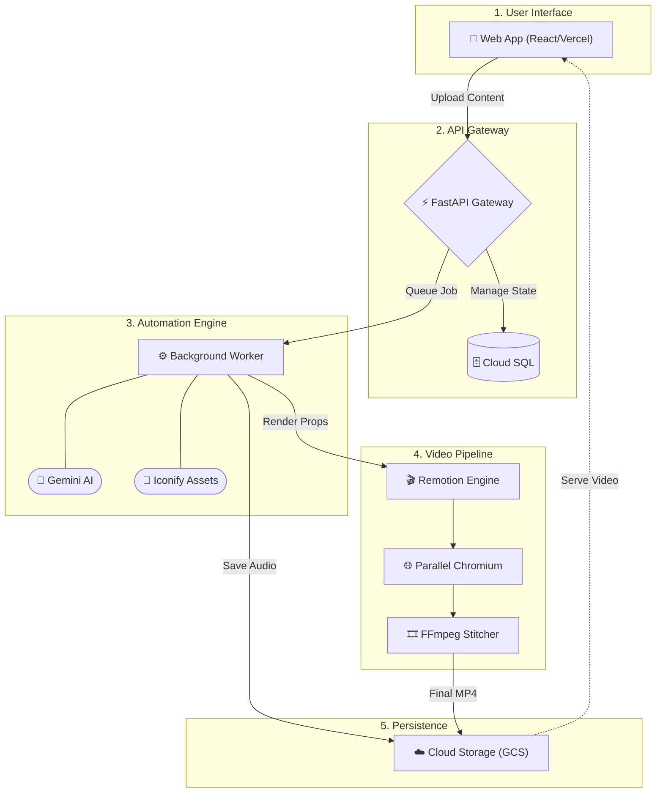

# Savra Video Generator System Architecture

This document provides a high-level overview of the Savra Video Generator platform's architecture, detailing how the frontend, backend, and external services interact to transform static text into dynamic whiteboard animations.

---

## 1. High-Level Architecture Diagram

---

## 2. Component Breakdown

### A. Frontend (Client Tier)
*   **Framework:** React (via Vite)
*   **Styling:** Tailwind CSS + Framer Motion for premium glassmorphic UI components.
*   **Hosting:** Deployed on **Vercel** for global edge caching and fast content delivery.
*   **Responsibility:** Handles user input, document uploads, and polls the backend for job status updates, rendering the final video player when complete.

### B. Backend (API & Orchestration Tier)
*   **Framework:** FastAPI (Python 3.10+)
*   **Database:** 
    *   *Local Dev:* SQLite via SQLAlchemy.
    *   *Production:* Google Cloud SQL (PostgreSQL) for persistence across stateless containers.
*   **Hosting:** Deployed on **Google Cloud Run** as a fully managed, auto-scaling container.
*   **Responsibility:** 
    *   Manages the REST API (`/upload`, `/generate`, `/jobs`).
    *   Handles authentication and rate limiting.
    *   Manages background ThreadPoolExecutors for async video generation.

### C. Rendering Engine
*   **Core:** **Remotion** (React-based programmatic video creation).
*   **Mechanics:**
    *   The Python backend generates a `RenderProps` JSON file containing all timing and asset data.
    *   It triggers the Remotion CLI via a subprocess.
    *   Remotion boots a headless Chromium browser to draw SVG frames (using staggered spring physics).
*   **Parallelization:** To achieve sub-3-minute exports, scenes are chunked and rendered simultaneously across multiple browser instances. **FFmpeg** is then used to stitch these chunks together without re-encoding.

### D. Intelligence & Assets (External Services)
*   **LLM Director:** Google's **Gemini API** is used to analyze document semantics, generate pedagogical scripts, and determine visual metaphors.
*   **Icon Fetcher:** Rather than relying on unpredictable AI image generation, a custom `icon_fetcher` dynamically retrieves high-quality, professional vector assets from libraries like Iconify.
*   **Storage:** **Google Cloud Storage (GCS)** acts as the central artifact repository for audio files, prop JSONs, and final MP4s in production.

---

## 3. Data Flow (The Document-to-Video Pipeline)

1.  **Ingestion:** User uploads a document. The backend extracts the text, validates it against size limits, and queues a Job.
2.  **Storyboarding:** The `llm_director.py` service chunks the text and prompts Gemini to return a `SceneScript` (narration + visual markup).
3.  **Choreography:** The system generates TTS audio for the narration. It calculates precise millisecond timings (`draw_start_ms`, `draw_duration_ms`) to ensure the whiteboard strokes sync perfectly with the spoken words, resulting in a `SceneChoreography` object.
4.  **Execution:** The `RenderProps` are passed to the Remotion engine. Headless Chromium draws the scenes in parallel.
5.  **Delivery:** FFmpeg stitches the scenes. The final `.mp4` is uploaded to GCS, the database marks the job as `completed`, and the Frontend plays the video.
